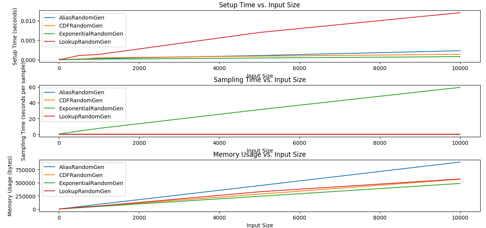
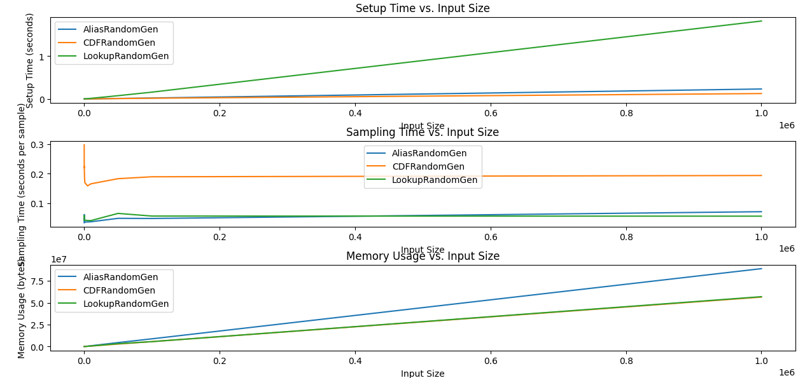

# 🎲 Weighted Random Sampling in Python

This repository implements and compares four methods for **weighted random sampling**, each adhering to a shared interface. The sampling methods are:

- `AliasRandomGen` – using the [Alias Method](https://en.wikipedia.org/wiki/Alias_method)
- `CDFRandomGen` – based on the cumulative distribution function and binary search
- `ExponentialRandomGen` – uses inverse transform sampling via exponential trick
- `LookupRandomGen` – builds a discrete lookup table with frequency of each value in the distribution

It also includes:
- A **shared interface** (`RandomGen`)
- A **driver notebook** for demonstrations
- A **profiler script** to compare **setup time**, **sampling time**, and **memory usage**
- A **test script** to verify correctness of the implementations

---

## 📦 Repository Structure

```
.
├── weighted_random_sampling/
│   ├── base.py                # Abstract interface `RandomGen`
│   ├── alias.py               # AliasRandomGen implementation
│   ├── cdf.py                 # CDFRandomGen implementation
│   ├── exponential.py         # ExponentialRandomGen implementation
│   ├── lookup.py              # LookupRandomGen implementation
│
├── profiler.py                # Script to measure time & memory, and plot results
├── test.py                # Script to test all implementations
├── demo.ipynb                 # Interactive notebook to test all methods
├── plots/
│   ├── setup_time.png
│   └── sampling_time.png
└── README.md
```

---

## 🧪 Usage

### Install dependencies

```bash
pip install matplotlib pympler numpy
```

### Run demo

```bash
python main.py
```

### Run profiler

```bash
python profiler.py
```

This will generate plots under `plots/`.

### Run tests

```bash
python -m unittest discover
```


### Use in notebook

Open `demo.ipynb` to:
- Experiment with different probability distributions
- Sample values from each method
- Visually inspect correctness

---

## 📊 Results





**Setup Time Interpretation:**  
- `AliasRandomGen` has moderate setup time with some overhead from table building.  
- `LookupRandomGen` increases steeply with input size due to lookup list size.
- `ExponentialRandomGen` and `CDFRandomGen` remain low-cost and scale well.

---

**Sampling Time Interpretation:**  
- `AliasRandomGen` and `LookupRandomGen` have **constant-time** sampling.
- `CDFRandomGen` scales **logarithmically** with input size.
- `ExponentialRandomGen` uses rejection-like sampling, so it's relatively slower and inconsistent.

---

**Memory Usage Interpretation:**  
- `LookupRandomGen` is **memory-intensive** due to expanded list.
- `AliasRandomGen` and `CDFRandomGen` are more efficient, and have **quick sample times**.
- `ExponentialRandomGen` uses only the original lists and weights, so is **memory-light**.

---

## 📌 Summary

| Method              | Setup Time | Sampling Time | Memory Usage | Notes |
|---------------------|------------|----------------|----------------|-------|
| `AliasRandomGen`    | **O(N)**     | **O(1)**        | **O(N)**       | Best overall for frequent sampling |
| `CDFRandomGen`      | **O(N)**        | **O(logN)**        | **O(N)**            | Simple and efficient |
| `ExponentialRandomGen` | **O(1)**     | **O(1)**            | **O(N)**            | Conceptually elegant, but slower |
| `LookupRandomGen`   | **O(K*N)**       | **O(1)**        | **O(K*N)**           | Only practical for small, simple distributions |
---

## ✅ When to Use What

| Use Case                         | Recommended Method       |
|----------------------------------|---------------------------|
| Fast repeated sampling           | `AliasRandomGen` or `LookupRandomGen` |
| Low-memory environments          | `CDFRandomGen`            |
